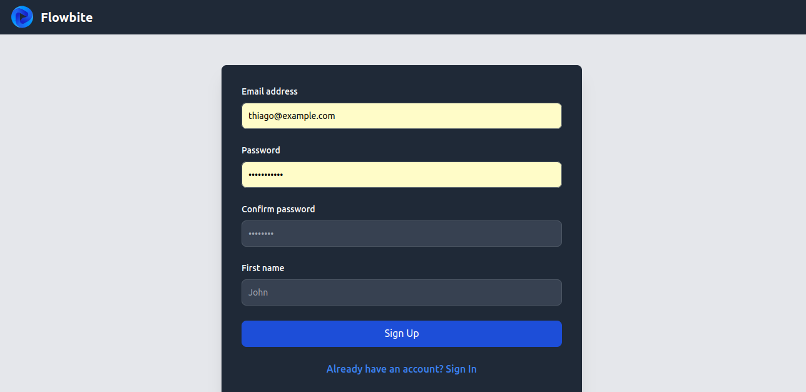

# AssistantNurseAngular

This project was generated with [Angular CLI](https://github.com/angular/angular-cli) version 18.1.4.

Aqui está a versão atualizada do README:

---

# Nurse Register Page Frontend

This is the frontend for the nurse marketplace application, now developed in Angular and styled with Tailwind CSS, connected to the Node.js backend.

## Prerequisites

Make sure you have Node.js installed on your machine.

- Node.js (minimum version 14.x.x)
- npm (minimum version 7.x.x)

## Installation

Clone this repository and install the necessary dependencies.

```bash
git clone https://github.com/thiagoassisk8/AssistantNurseAngular
cd ASSISTANTNURSEANGULAR
npm install
```

## Backend Configuration

Before starting the frontend, make sure the backend is properly configured and running at the correct URL.

## Running the Application

To start the Angular application, use the following command:

```bash
npm run start
```

The application will run in development mode.<br />
Open [http://localhost:4200](http://localhost:4200) in your browser to view it.

## Features




## Technologies Used

- Angular
- Tailwind CSS
- Angular Router for managing routes

## More Information

For more details about the project, check out the corresponding [backend repository](https://github.com/thiagoassisk8/nurse-assistant).

---

This project was developed as part of a nurse marketplace application, focusing on registration and login functionalities using JWT for authentication.
